<picture>
  <source media="(prefers-color-scheme: dark)" srcset=".github/assets/hero-dark.svg">
  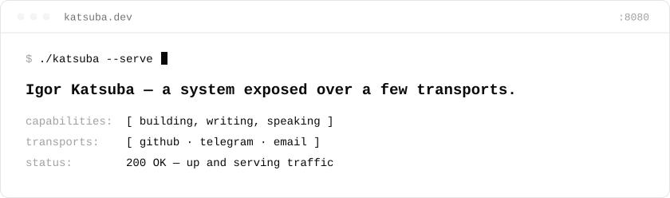
</picture>

<picture>
  <source media="(prefers-color-scheme: dark)" srcset=".github/assets/manifest-dark.svg">
  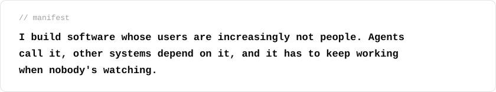
</picture>

<picture>
  <source media="(prefers-color-scheme: dark)" srcset=".github/assets/about-dark.svg">
  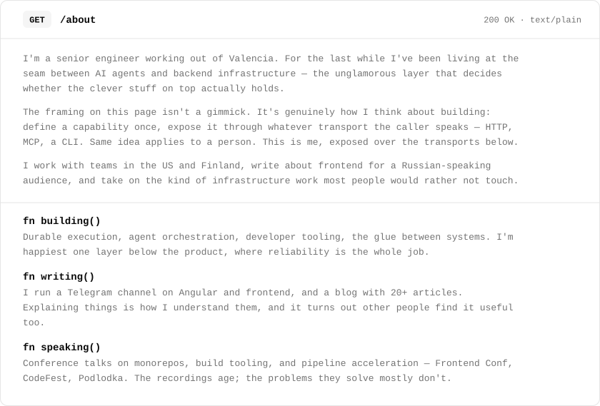
</picture>

<picture>
  <source media="(prefers-color-scheme: dark)" srcset=".github/assets/tools-header-dark.svg">
  
</picture>

<a href="https://ng.guide">
  <picture>
    <source media="(prefers-color-scheme: dark)" srcset=".github/assets/tool-01-dark.svg">
    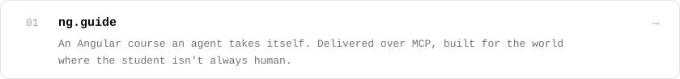
  </picture>
</a>

<a href="https://github.com/IKatsuba/roost">
  <picture>
    <source media="(prefers-color-scheme: dark)" srcset=".github/assets/tool-02-dark.svg">
    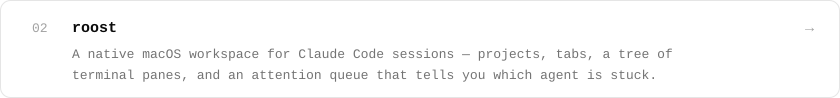
  </picture>
</a>

<a href="https://github.com/IKatsuba/nx-cache-server">
  <picture>
    <source media="(prefers-color-scheme: dark)" srcset=".github/assets/tool-03-dark.svg">
    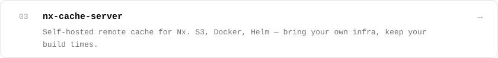
  </picture>
</a>

<a href="https://github.com/IKatsuba/mutates">
  <picture>
    <source media="(prefers-color-scheme: dark)" srcset=".github/assets/tool-04-dark.svg">
    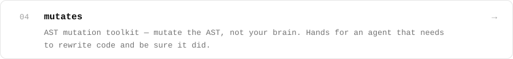
  </picture>
</a>

<a href="https://github.com/IKatsuba/ng-http">
  <picture>
    <source media="(prefers-color-scheme: dark)" srcset=".github/assets/tool-05-dark.svg">
    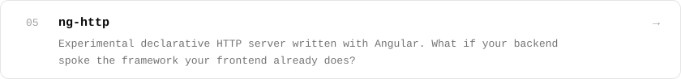
  </picture>
</a>

<a href="https://github.com/IKatsuba/deno-mastra">
  <picture>
    <source media="(prefers-color-scheme: dark)" srcset=".github/assets/tool-06-dark.svg">
    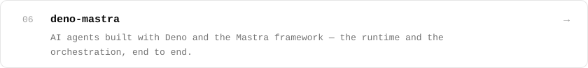
  </picture>
</a>

<a href="https://github.com/IKatsuba/serverless-redis">
  <picture>
    <source media="(prefers-color-scheme: dark)" srcset=".github/assets/tool-07-dark.svg">
    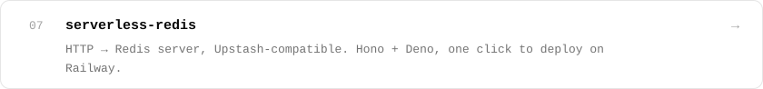
  </picture>
</a>

<picture>
  <source media="(prefers-color-scheme: dark)" srcset=".github/assets/speaking-header-dark.svg">
  
</picture>

<a href="https://www.youtube.com/watch?v=pqV863ysMRQ">
  <picture>
    <source media="(prefers-color-scheme: dark)" srcset=".github/assets/talk-01-dark.svg">
    
  </picture>
</a>

<a href="https://youtu.be/j0OhmZeAoKQ">
  <picture>
    <source media="(prefers-color-scheme: dark)" srcset=".github/assets/talk-02-dark.svg">
    
  </picture>
</a>

<a href="https://www.youtube.com/watch?v=D-JwmfQKfIE">
  <picture>
    <source media="(prefers-color-scheme: dark)" srcset=".github/assets/talk-03-dark.svg">
    
  </picture>
</a>

<picture>
  <source media="(prefers-color-scheme: dark)" srcset=".github/assets/experience-dark.svg">
  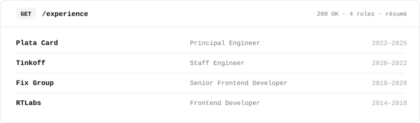
</picture>

<picture>
  <source media="(prefers-color-scheme: dark)" srcset=".github/assets/contact-dark.svg">
  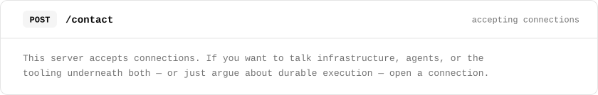
</picture>

  <a href="https://github.com/IKatsuba"><picture><source media="(prefers-color-scheme: dark)" srcset=".github/assets/pill-github-dark.svg"></picture></a>
  <a href="https://x.com/katsuba_igor"><picture><source media="(prefers-color-scheme: dark)" srcset=".github/assets/pill-x-dark.svg"></picture></a>
  <a href="https://www.instagram.com/igor.katsuba/"><picture><source media="(prefers-color-scheme: dark)" srcset=".github/assets/pill-instagram-dark.svg">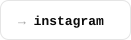</picture></a>
  <a href="https://t.me/Katsuba"><picture><source media="(prefers-color-scheme: dark)" srcset=".github/assets/pill-telegram-dark.svg">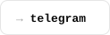</picture></a>
  <a href="mailto:igor@katsuba.dev"><picture><source media="(prefers-color-scheme: dark)" srcset=".github/assets/pill-email-dark.svg">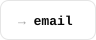</picture></a>

<a href="https://katsuba.dev">
  <picture>
    <source media="(prefers-color-scheme: dark)" srcset=".github/assets/footer-dark.svg">
    
  </picture>
</a>
